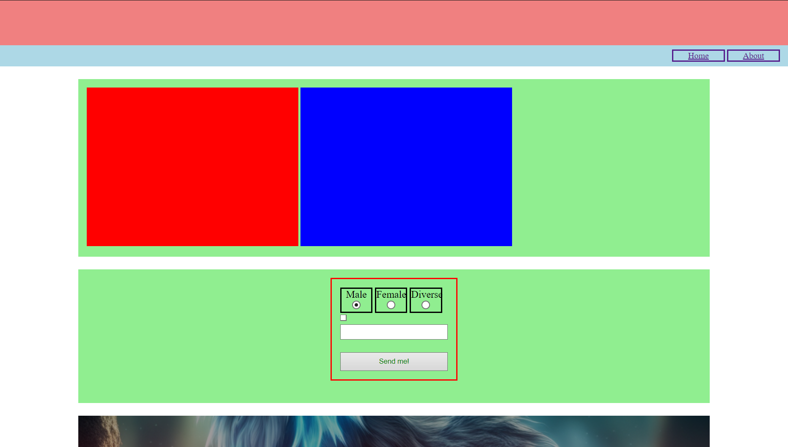
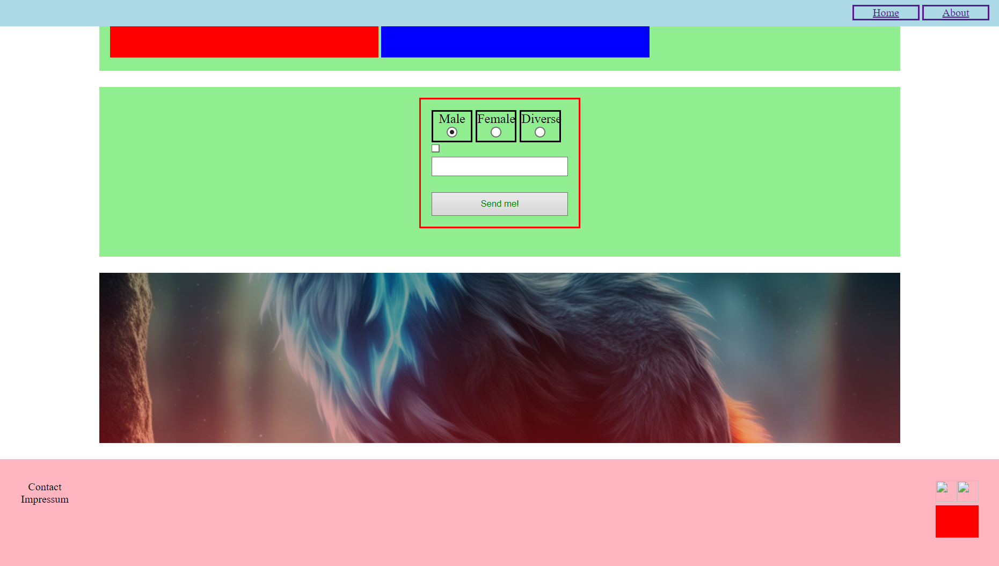

# Basic Recap

## Beantworte folgende Fragen

- Was ist das besondere an einem `block` Element?

  Antwort:
  Ein block-Element nimmt immer den gesamten verfügbaren Raum in seiner Zeile ein und beginnt in einer neuen Zeile. Dadurch wird der nachfolgende Inhalt automatisch unterhalb des block-Elements platziert.
  <!-- Beispielhafte Block-Elemente: Zu den typischen block-Elementen gehören 
, 
, <h1>, <section>, <article>, <header>, <footer> und viele andere HTML-Elemente. -->

- Was ist das besondere an einem `inline` Element?

  Antwort:
  inline-Elemente verursachen keinen Zeilenumbruch vor oder nach dem Element. Sie erscheinen in derselben Zeile, in der der vorherige Text oder das vorherige Element endet, und geben nur so viel horizontalen Raum wie nötig.
  <!-- Zu den typischen inline-Elementen gehören HTML-Tags wie , <a>, <strong>, <em>, <b>, <i>, und . -->

- Was ist das besondere an einem `inline-block` Element?

  Antwort:
  inline-block ist eine Kombination aus den Eigenschaften von block und inline-Elementen. Ein inline-block-Element verhält sich wie ein inline-Element, indem es nebeneinander mit anderen inline-Elementen angezeigt wird, aber gleichzeitig verhält es sich wie ein block-Element, da es die Möglichkeit hat, eine eigene Breite und Höhe zu definieren.

- Welche Art von Element ist ein `input` Element?

  Antwort:
  Ein `<input>`-Element ist ein inline-Element in HTML. Es wird häufig verwendet, um Benutzereingaben zu erhalten, wie z. B. Text, Passwörter, Checkboxen, Radiobuttons und vieles mehr. Das input-Element ist besonders flexibel und kann durch das type-Attribut angepasst werden, um verschiedene Arten von Eingabefeldern zu erstellen.

- Welche Art von Element ist ein `table` Element?

  Antwort:
  Ein `<table>`-Element ist ein block-level (Block-Element) in HTML. Das bedeutet, dass es den gesamten verfügbaren horizontalen Raum einnimmt und in der Regel eine neue Zeile beginnt. Es wird verwendet, um tabellarische Daten darzustellen, und enthält in der Regel weitere untergeordnete Elemente wie `<tr>` (für Tabellenzeilen), `<td>` (für Tabellendaten) und `<th>` (für Tabellenüberschriften).

- Welche Art von Element ist ein `div` Element?

  Antwort:Ein `
`-Element ist ein block-level (Block-Element) in HTML. Das bedeutet, dass es den gesamten verfügbaren horizontalen Raum einnimmt und in der Regel eine neue Zeile beginnt. Das `
`-Element wird häufig als Container-Element verwendet, um andere HTML-Elemente zu gruppieren und zu strukturieren, ohne selbst eine visuelle Darstellung zu haben.

- Welche Art von Element ist ein `a` Element?

  Antwort: Ein `a`-Element ist ein inline-Element in HTML. Es wird verwendet, um Hyperlinks zu erstellen, die auf andere Seiten oder Ressourcen verweisen. Ein `a`-Tag kann auf Webseiten, Dokumente, Bilder, E-Mail-Adressen oder jede andere URL verweisen.

- Welche Art von Element ist ein `body` Element?

  Antwort:Das `<body>`-Element ist ein block-level (Block-Element) in HTML. Es bildet den Hauptinhalt einer HTML-Seite und enthält alle sichtbaren Elemente, die auf der Webseite angezeigt werden, wie Text, Bilder, Tabellen, Links, Formulare und andere Inhalte. Das `<body>`-Element umfasst alle Inhalte, die im Browser angezeigt werden, im Gegensatz zum `<head>`-Element, das Metadaten und andere nicht sichtbare Informationen enthält.

- Welche Art von Element ist ein `form` Element?

  Antwort: Ein `<form> `-Element ist ein block-level (Block-Element) in HTML. Es wird verwendet, um Benutzereingaben zu sammeln und diese an den Server zu senden. Ein Formular enthält in der Regel verschiedene Eingabefelder wie Textfelder, Checkboxen, Radiobuttons, Buttons und andere Steuerungselemente. Das `<form> `Element bietet eine strukturierte Möglichkeit, um Benutzerdaten zu erfassen und zu verarbeiten.

- Wann funktioniert `text-aline: center`?

  Antwort: Das CSS-Attribut text-align: center funktioniert, wenn es auf ein Block-Element angewendet wird, das Text oder inline-Elemente enthält. Es zentriert den darin enthaltenen Text oder Inline-Elemente (wie Links, Bilder, etc.) innerhalb des Block-Elements.

- Wie kann man ein `block` Element zentrieren?

  Antwort: Ein block-level Element wie ein `
, <section>, oder <article>` kann auf verschiedene Arten horizontal und vertikal zentriert werden.Die häufigste Methode, um ein Block-Element horizontal zu zentrieren, ist die Verwendung von margin: auto.

- Wie kennzeichnet man eine `id` im CSS?

  Antwort:
  Eine id muss in einem HTML-Dokument eindeutig sein. Das bedeutet, dass eine id nur einmal pro Seite verwendet werden sollte. Sie ist ein einzigartiger Identifikator für ein bestimmtes Element.
  id-Selektoren haben eine höhere Spezifität als class-Selektoren. Das bedeutet, dass Styles, die auf eine id angewendet werden, stärker sind und Priorität gegenüber denen einer class haben, wenn beide dasselbe Element ansprechen.

## Aufgaben

Die Hauptaufgabe wird es sein eine Webseite zu bauen, die dem Bild so ähnlich wie möglich kommt. Beachte hierbei folgende Punkte:

1. Der Header hat eine Höhe von 10% der Höhe des Viewports

2. Die Navigation hat eine Höhe von `40px`, allerdings in `rem` und bleibt oben am Fenster kleben (KLEBEN!).

   - Richte die Links rechts aus. **Benutze KEIN position!**

3. Alle Sections sind Zentriert, mindestens 30% der Höhe des Viewports hocht und haben haben `1.5rem` abstand zueinander.

   - Section 1
     - in dieser Section sind zwei Cards (`div`), die `400px` Breit und `300px` Hoch sind. **Benutze KEIN position!**
   - Section 2
     - Das Formular soll mittig ausgerechtet sein und eine Breite von `15rem` haben.

- Section 3
  - richte das Hintergrundbild so gut wie möglich aus
  - sorge dafür, dass das Hintergrundbild nur noch `60%` der ursprünglichen Helligkeit (`brightness`) hat.

4. Der Footer hat eine Höhe von `160px` in `rem`
   - Richte die Icons rechts und die Links links aus. **Nutze KEINE position!**

## Hilfestellung

[Klassen und ID´s](https://github.com/dci-fbw-wd-24-d07-a/resources/tree/main/02-UIB/01-fundamentals/02-UI-styles-classes-id#classes-vs-idś)

[Margin und Padding](https://github.com/dci-fbw-wd-24-d07-a/resources/tree/main/02-UIB/04-data/02-forms#formular)

[block, inline und inline-block](https://github.com/dci-fbw-wd-24-d07-a/resources/tree/main/02-UIB/02-Boxes/01-UI-Box-Model#ändern-der-eigenschaften-eines-elementes)

[Background Image vs Image](https://github.com/dci-fbw-wd-24-d07-a/resources/tree/main/02-UIB/02-Boxes/02-ui-bg#background-image-vs-image)

[Forms](https://github.com/dci-fbw-wd-24-d07-a/resources/tree/main/02-UIB/04-data/02-forms#formular)
